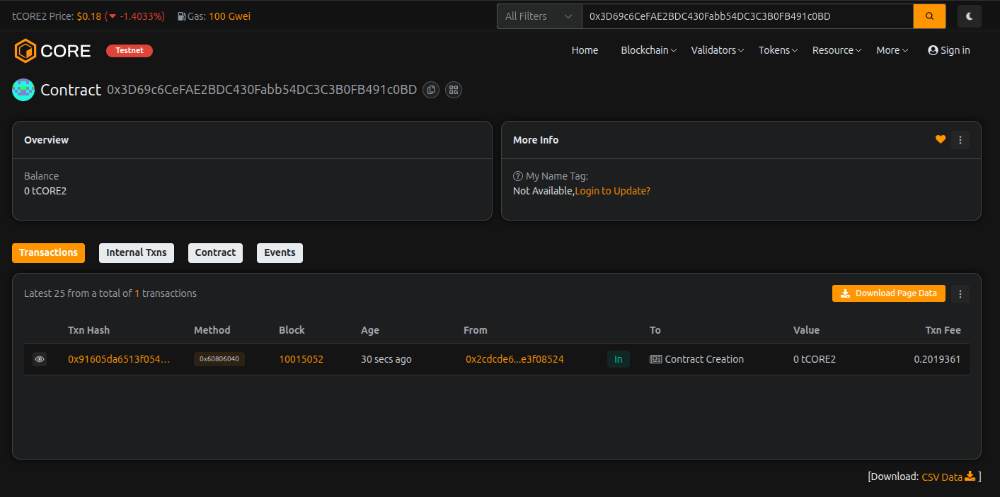

# FlashStake Protocol

## Project Description

FlashStake Protocol is a revolutionary decentralized finance (DeFi) platform that combines traditional staking mechanisms with flash loan capabilities. Built on the Ethereum blockchain, it allows users to stake their tokens for various lock periods while earning competitive rewards, and simultaneously provides liquidity through flash loans for advanced DeFi operations. The protocol features dynamic reward rates based on lock periods, ensuring that long-term supporters receive higher returns while maintaining protocol security and sustainability.

## Project Vision

Our vision is to create a comprehensive DeFi ecosystem that bridges the gap between passive income generation and active liquidity provision. FlashStake Protocol aims to:

- **Democratize DeFi**: Make advanced financial instruments accessible to everyone, from beginners to experienced traders
- **Maximize Capital Efficiency**: Enable users to earn rewards while their assets contribute to protocol liquidity
- **Foster Innovation**: Provide developers and traders with the tools needed for sophisticated DeFi strategies
- **Build Sustainable Growth**: Create a self-sustaining protocol where flash loan fees fund staking rewards
- **Ensure Security**: Implement robust smart contract architecture with transparent, auditable code

## Key Features

### 1. **Flexible Staking System**
- Multiple lock period options (1 day to 365 days)
- Dynamic reward rates: 3% to 15% APY based on lock duration
- Transparent reward calculation visible on-chain
- Individual stake tracking with detailed history

### 2. **Flash Loan Integration**
- Instant, collateral-free loans within a single transaction
- Competitive 0.09% fee structure
- Perfect for arbitrage, liquidations, and complex DeFi strategies
- Automatic fee distribution to reward pool

### 3. **Smart Reward Distribution**
- Rewards calculated based on time-weighted staking
- Self-funding mechanism through flash loan fees
- Flexible reward pool that anyone can contribute to
- Real-time pending reward tracking

### 4. **Advanced Security Features**
- Emergency pause functionality for protocol protection
- Owner-controlled administrative functions
- Lock period enforcement preventing premature withdrawals
- Comprehensive event logging for transparency

### 5. **User-Friendly Design**
- Simple stake and unstake functions
- View all active stakes at once
- Calculate pending rewards before claiming
- Automatic reward distribution on unstaking

### 6. **Capital Efficiency**
- Staked funds contribute to flash loan liquidity pool
- No idle capital in the protocol
- Dual utility maximizes returns for all participants
- Sustainable economic model

### 7. **Transparency & Trust**
- Open-source smart contract code
- Immutable blockchain records
- Event-driven architecture for easy tracking
- No hidden fees or mechanics

### 8. **Scalability**
- Gas-optimized operations
- Efficient data structures
- Support for unlimited users and stakes
- Future-proof architecture

### 9. **Interoperability**
- Standard ERC-20 compatible (can be extended)
- Easy integration with other DeFi protocols
- Compatible with major wallets and platforms
- Composable with other smart contracts

### 10. **Economic Sustainability**
- Self-funding reward mechanism
- Balanced incentive structure
- Flash loan fees sustain long-term operations
- Community-driven growth model

## Future Scope

### Phase 1: Enhanced Features (Q1-Q2 2026)
- **Multi-Token Support**: Extend beyond ETH to support ERC-20 tokens
- **NFT Staking**: Allow users to stake NFTs for exclusive rewards
- **Governance Token**: Launch native governance token for protocol decisions
- **Auto-Compounding**: Implement automatic reward reinvestment options

### Phase 2: Advanced DeFi Integration (Q3-Q4 2026)
- **Lending/Borrowing**: Add traditional lending features with collateral
- **Liquidity Mining**: Introduce LP token staking rewards
- **Cross-Chain Bridge**: Expand to other blockchains (Polygon, BSC, Arbitrum)
- **Yield Aggregator**: Integrate with other protocols for optimal returns

### Phase 3: Institutional Features (2027)
- **Vault Strategies**: Automated yield optimization strategies
- **Insurance Fund**: Protocol insurance for additional security
- **Institutional Dashboard**: Advanced analytics and reporting tools
- **API Access**: Developer-friendly API for integrations

### Phase 4: Ecosystem Expansion (2027-2028)
- **Mobile App**: Native iOS and Android applications
- **Social Features**: Community staking pools and leaderboards
- **Educational Platform**: DeFi learning resources and tutorials
- **Partnerships**: Strategic alliances with major DeFi protocols

### Technical Improvements
- **Layer 2 Integration**: Deploy on Optimism, zkSync for lower fees
- **Advanced Flash Loans**: Multi-token flash loans in single transaction
- **MEV Protection**: Implement protections against front-running
- **Formal Verification**: Mathematical proof of contract correctness
- **Upgradability**: Implement proxy patterns for safe upgrades

### Community & Governance
- **DAO Formation**: Transition to full community governance
- **Grant Program**: Fund ecosystem developers and researchers
- **Bug Bounty**: Ongoing security audit and bounty program
- **Decentralization**: Progressive decentralization roadmap

---

**Disclaimer**: This is experimental DeFi software. Always do your own research and never invest more than you can afford to lose. Smart contracts carry inherent risks including bugs, hacks, and market volatility.

**License**: MIT License - Feel free to use, modify, and distribute this code.

**Contact**: For questions, partnerships, or security concerns, please open an issue on our repository.

---

## Contract Details:

Transaction id: 0x3D69c6CeFAE2BDC430Fabb54DC3C3B0FB491c0BD
